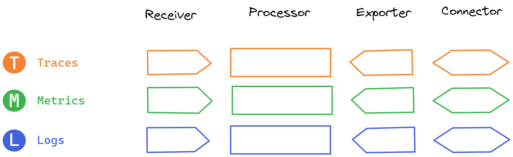

# Observability Diagramming

Somewhat opinionated assets for Observability Diagramming. 

## Samples

</pre>
</pre>

## Associations

* I am not in anyway associated with OpenTelemetry or CNCF and do not intend to mis-represent that fact in anyway. 

## Goals

* Provide a set of ready to go Icons for various Observability Concepts
* Help create better diagraming for the Observability Ecosystem
* Adopt diagraming standards with the help of community review when they provide a clear value add.
* Use existing concepts / iconology where it is allowed
* If a concept does not yet exist create an icon for it

## Non Goals

* Dictate how to diagram / what icons to use
* Try to Adhere to every diagramming standard / approach, without subject matter experts / community support. If I don't understand a diagraming standard I won't phone it in. 
* Play one upmanship against current diagrams used to demonstrate Observability concepts. I use them as inspiration for my examples, but am certainly not saying my way is right!
* Be a SIG (Special Interest Group)
* Be biased towards a vendor

## Why Non Goals

* Below are a few representations of the Data Flow of the Otel Demo App. https://opentelemetry.io/docs/demo/collector-data-flow-dashboard/#data-flow-overview 
* All representations, I feel, accurately represent the state of what's going on with the Otel Demo App
* However the diagrams are quite different in the way they represent the information
* There are many other ways to represent this information. Hence why I don't want to dictate adherence to models but rather focus on providing raw assets that people can use as they want. 

## Rationale

* This medium article covers a lot of the decisions made with these icons. 
* #TODO write the article

## Excalidraw as a First Class Citizen

* Most of these Icon Sets were created and are distributed as Excalidraw Assets. 
* Excalidraw provides very useful tools to export a component of library to SVG or PNG but with 81+ assets that's becoming impratical to maintain. 
* I Provide the Excalidraw assets I used to create the icons and in future will think about CI/CD automation to package these in different ways
* I might convert these to pure SVG representations further down the track if there is interest. 

## TODO:

* Upload to Excalidraw Library Database
* Convert to SVG Icons
* Add SLI / SLO Icon Set
* Add Path to convert to Visio Stencils for Example
* Add further diagrams about 3rd party integrations (e.g. AWS X-Ray)
* Concept - Log Bridge API https://opentelemetry.io/docs/reference/specification/logs/bridge-api/
* Concept - Connectors: https://github.com/open-telemetry/opentelemetry-collector/blob/main/connector/README.md
* Example - djaglowski for Collector Architecture with SDK components

## Attributions 

* [@devrimdemiroz] Devrim Demiroz for initial inspiration and continued support
* [@djaglowski] For his excellent Kubecon 2023 Presentation
* [@open-telemetry] OpenTelemetry for providing seed icons via their opentelemetry.io repo: https://github.com/open-telemetry/opentelemetry.io/tree/main/iconography
* sachamaps for inspiration for highly seperated colors: https://sashamaps.net/docs/resources/20-colors/
* [@yurishkuro] Yuri Shkuro for his TEMPLE model https://medium.com/@YuriShkuro/temple-six-pillars-of-observability-4ac3e3deb402

